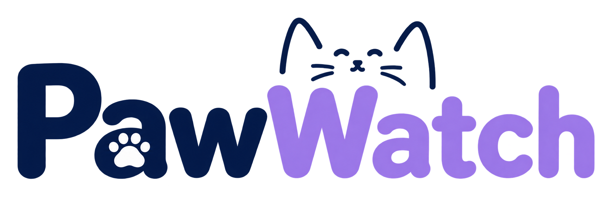

<p align="center">
  
</p>

<h1 align="center">PawWatch</h1>

<p align="center">
  <strong>A Community-Driven Stray Cat Rescue, Tracking & Adoption Platform</strong>
</p>

<p align="center">
  <a href="https://github.com/tian573/paw-watch/actions/workflows/flutter_ci.yml">
    
  </a>
  
  
  
  
  
</p>

---

## 📌 Project Overview

**PawWatch** is a cross-platform mobile application built with **Flutter** and **Firebase** that empowers volunteers, animal lovers, and local shelters to safeguard community cats. 

Users can report geolocated stray cat sightings, log ongoing care activities (feeding, medical checkups, fostering), verify cat status using on-device machine learning, coordinate adoptions through a multi-applicant management system, and communicate securely in real time.

---

## 🚀 Key Features

* **Interactive Map & Live Feed:** Browse nearby sightings pinned with GPS coordinates, distance indicators, urgency tags, and health status (ear-tipped, injured, trapped).
* **On-Device AI Validation:** Leverages **Google ML Kit Image Labeling** to run offline computer vision directly on the device, ensuring reported images depict cats and validating rescue action proofs without incurring external cloud API costs.
* **Multi-Applicant Adoption System:** Caretakers can review multiple pending adoption applications in a dedicated bottom-sheet dashboard, inspect applicant notes, initiate private coordination chats, and approve or decline requests with real-time UI updates.
* **Realtime Chat & Coordination:** Direct messaging between adopters, caretakers, and volunteers with live read receipts, media sharing, and block/unblock security controls.
* **Rescue Milestones & Recognition:** Earn rescue badges and milestone recognition for community contributions (colony feeder, night patrol, warm haven foster).
* **Role-Based Admin Console:** Integrated admin dashboard to review flagged content, resolve community moderation reports, manage announcements, and inspect shelter directories.

---

## 🛠️ Architecture & Engineering Highlights

* **Stateful Architecture + Service Layer:** Clean separation between presentation screens and business/data services ([FirebaseService](lib/services/firebase_service.dart), [LocationService](lib/services/location_service.dart), [TextModerationService](lib/services/text_moderation_service.dart)).
* **Hardened Security Rules:** Dedicated [firestore.rules](firestore.rules) and [storage.rules](storage.rules) protecting document collections and media buckets against unauthorized manipulation.
* **Local Offline Emulators:** Fully configured Firebase Local Emulator Suite support ([firebase.json](firebase.json)), enabling offline development without touching production cloud data.
* **Automated CI/CD:** GitHub Actions workflow ([.github/workflows/flutter_ci.yml](.github/workflows/flutter_ci.yml)) automatically runs static analysis (`flutter analyze`) and unit/widget tests on every commit and pull request.

---

## 💻 Installation & Getting Started

### Prerequisites

Ensure you have the following installed on your machine:
* [Flutter SDK](https://flutter.dev/docs/get-started/install) (3.22.x or later)
* [Java Development Kit](https://adoptium.net/) (JDK 17 or JDK 21)
* Android Studio or Xcode (with Android/iOS SDKs & Emulators configured)

### 1. Clone the Repository

```bash
git clone https://github.com/tian573/paw-watch.git
cd paw-watch
```

### 2. Install Dependencies

Using Flutter CLI:
```bash
flutter pub get
```

Or using the project task runners:
* **macOS / Linux:** `make setup`
* **Windows (PowerShell):** `.\scripts\dev.ps1 setup`

### 3. Run Static Analysis & Tests

Verify code health and test suite:
```bash
# Static analysis
flutter analyze

# Unit & Widget tests (25 tests)
flutter test
```

### 4. Run the Application

```bash
flutter run
```

### 5. (Optional) Run with Local Firebase Emulators

To run PawWatch completely offline using mock local databases:

1. **Start Emulators:**
   ```bash
   firebase emulators:start
   # Or on Windows: .\scripts\dev.ps1 emulators
   ```
   Open `http://localhost:4000` to inspect the local Firestore and Auth dashboard.

2. **Launch App in Emulator Mode:**
   ```bash
   flutter run --dart-define=USE_EMULATOR=true
   # Or on Windows: .\scripts\dev.ps1 run-emulator
   ```

---

## 📦 Building Production APK

To build a standalone release APK for testing on an Android device:

```bash
flutter build apk --release
```

The compiled APK will be located at:
```text
build/app/outputs/flutter-apk/app-release.apk
```

---

## 📂 Project Structure

```text
paw_watch/
├── .github/
│   └── workflows/
│       └── flutter_ci.yml      # Automated GitHub Actions CI workflow
├── assets/
│   └── images/                 # App logo, badge icons, and illustrations
├── lib/
│   ├── models/                 # Data models (Sighting, UserProfile, ChatMessage, etc.)
│   ├── services/               # Firebase, AI ML Kit, Location, and Text Moderation services
│   ├── utils/                  # Double-tap guards and utilities
│   ├── views/
│   │   ├── screens/            # UI screens (HomeFeed, Map, Detail, Admin, Profile, Auth)
│   │   └── widgets/            # Reusable UI widgets (PawImage, VideoPlayer, ShelterPicker)
│   ├── firebase_options.dart   # FlutterFire configuration
│   └── main.dart               # Entry point and emulator routing
├── scripts/
│   └── dev.ps1                 # Windows PowerShell developer task runner
├── test/                       # Unit, widget, and role logic test suite (25 tests)
├── firestore.rules             # Cloud Firestore authorization rules
├── storage.rules               # Cloud Storage access rules
├── firebase.json               # Firebase configuration & emulator ports
├── Makefile                    # Cross-platform command automation
└── pubspec.yaml                # App dependencies and assets declaration
```

---

## 🤝 Contributing

Contributions, feedback, and issue reports are welcome!
1. Fork the Project
2. Create your Feature Branch (`git checkout -b feature/NewFeature`)
3. Commit your Changes (`git commit -m 'feat: Add NewFeature'`)
4. Push to the Branch (`git push origin feature/NewFeature`)
5. Open a Pull Request

---

## 📄 License

This project is licensed under the MIT License - see the [LICENSE](LICENSE) file for details.
